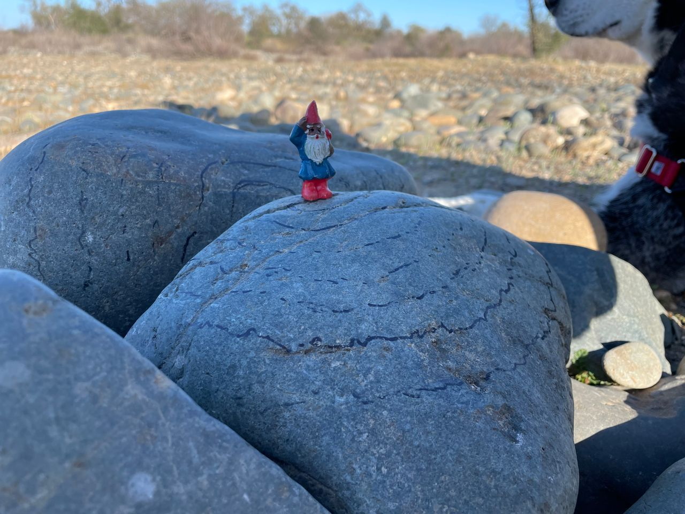

# a-gnome-pattern

A game inspired by a moment at the lake with my partner and our dog where we encountered a rock maze and a gnome.
It made us recall walking the "pattern" in The Chronicles of Amber by [Roger Zelazny](https://en.wikipedia.org/wiki/Roger_Zelazny).
I hope to create an experience similar.

## How to launch the game
Clone or fork this repo to your local machine and open the game.html file in your browser. 

## General Gameplay and Mechanics
Using the directional keys or WASD, simply walk the pattern.

## Resources Used
[Sprout Lands Asset Pack Made by: Cup Nooble](https://cupnooble.itch.io/sprout-lands-asset-pack)

[Gnome Sprite for Fantasy Forest Tileset Made By: Ross Holmes](https://chromegnomes.itch.io/gnome-sprite-for-fantasy-forest-tileset)

## Personal Goals
To quiet the fear that tells me I *can't*. You **can** and **will** do this. I believe in you, me. xoxo 
Additions I'd like to add:
- Swap the location of the player chacter and the gnome
- Add music and warp it depending on player speed
